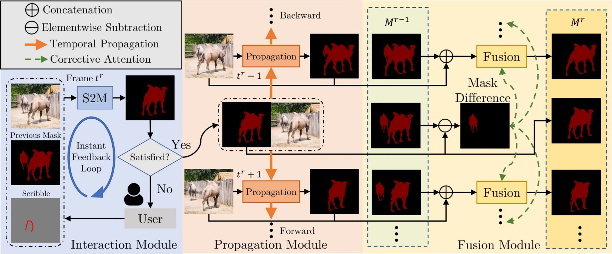

# Modular Interactive Video Object Segmentation: Interaction-to-Mask, Propagation and Difference-Aware Fusion (MiVOS)

[Ho Kei Cheng](https://hkchengrex.github.io/), Yu-Wing Tai, Chi-Keung Tang

CVPR 2021

[[arXiv]](https://arxiv.org/abs/2103.07941) [[Paper PDF]](https://arxiv.org/pdf/2103.07941.pdf) [[Project Page]](https://hkchengrex.github.io/MiVOS/) [[Demo]](https://hkchengrex.github.io/MiVOS/video.html#partb) [[Papers with Code]](https://paperswithcode.com/task/interactive-video-object-segmentation) [[Supplementary Material]](docs/supplementary.pdf)

## Newer: check out our new work on long-term VOS [XMem](https://github.com/hkchengrex/XMem). It also includes an interactive GUI!

## New: see the [STCN branch](https://github.com/hkchengrex/MiVOS/tree/MiVOS-STCN) for a better and faster version.

  

<sub><sup>Credit (left to right): DAVIS 2017, [Academy of Historical Fencing](https://youtu.be/966ulgwEcyc), [Modern History TV](https://youtu.be/e_D1ZQ7Hu0g)</sup></sub>

We manage the project using three different repositories (which are actually in the paper title). This is the main repo, see also [Mask-Propagation](https://github.com/hkchengrex/Mask-Propagation) and [Scribble-to-Mask](https://github.com/hkchengrex/Scribble-to-Mask).

## Overall structure and capabilities

| | [MiVOS](https://github.com/hkchengrex/MiVOS) | [Mask-Propagation](https://github.com/hkchengrex/Mask-Propagation)| [Scribble-to-Mask](https://github.com/hkchengrex/Scribble-to-Mask)  |
| ------------- |:-------------:|:-----:|:-----:|
| DAVIS/YouTube semi-supervised evaluation | :x: | :heavy_check_mark: | :x: |
| DAVIS interactive evaluation | :heavy_check_mark: | :x: | :x: |
| User interaction GUI tool | :heavy_check_mark: | :x: | :x: |
| Dense Correspondences | :x: | :heavy_check_mark: | :x: |
| Train propagation module | :x: | :heavy_check_mark: | :x: |
| Train S2M (interaction) module | :x: | :x: | :heavy_check_mark: |
| Train fusion module | :heavy_check_mark: | :x: | :x: |
| Generate more synthetic data | :heavy_check_mark: | :x: | :x: |

## Framework



## Requirements

We used these packages/versions in the development of this project. It is likely that higher versions of the same package will also work. This is not an exhaustive list -- other common python packages (e.g. pillow) are expected and not listed.

- PyTorch `1.7.1`
- torchvision `0.8.2`
- OpenCV `4.2.0`
- Cython
- progressbar
- davis-interactive (<https://github.com/albertomontesg/davis-interactive>)
- PyQt5 for GUI
- networkx `2.4` for DAVIS
- gitpython for training
- gdown for downloading pretrained models

Refer to the official [PyTorch guide]((<https://pytorch.org/>)) for installing PyTorch/torchvision. The rest can be installed by:

`pip install PyQt5 davisinteractive progressbar2 opencv-python networkx gitpython gdown Cython`

## Quick start

### GUI

1. `python download_model.py` to get all the required models.
2. `python interactive_gui.py --video <path to video>` or `python interactive_gui.py --images <path to a folder of images>`. A video has been prepared for you at `example/example.mp4`.
3. If you need to label more than one object, additionally specify `--num_objects <number_of_objects>`. See all the argument options with `python interactive_gui.py --help`.
4. There are instructions in the GUI. You can also watch the [demo videos](https://hkchengrex.github.io/MiVOS/video.html#partb) for some ideas.

### DAVIS Interactive VOS

See `eval_interactive_davis.py`. If you have downloaded the datasets and pretrained models using our script, you only need to specify the output path, i.e., `python eval_interactive_davis.py --output [somewhere]`.

### DAVIS/YouTube Semi-supervised VOS

Go to this repo: [Mask-Propagation](https://github.com/hkchengrex/Mask-Propagation).

## Main Results

### [DAVIS/YouTube semi-supervised results](https://github.com/hkchengrex/Mask-Propagation/#main-results)

### DAVIS Interactive Track

All results are generated using the unmodified [official DAVIS interactive bot](https://github.com/albertomontesg/davis-interactive) without saving masks (`--save_mask` not specified) and with an RTX 2080Ti. We follow the [official protocol](https://interactive.davischallenge.org/user_guide/usage/).

Precomputed result, with the json summary: [[Google Drive]](https://drive.google.com/file/d/1WMPCXs5FNAF3dE2Ubg_SYegZaOd1cATM/view?usp=sharing) [[OneDrive]](https://hkustconnect-my.sharepoint.com/:u:/g/personal/hkchengad_connect_ust_hk/EXLxK6VPO7BDodHlos6TDS0BZ7J38pDIhmjit9W5utLXmQ?e=8e06sE)

`eval_interactive_davis.py`

| Model | AUC-J&F | J&F @ 60s |
| --- |:--:|:---:|
| Baseline | 86.0 | 86.6 |
| (+) Top-k | 87.2 | 87.8 |
| (+) BL30K pretraining | 87.4 | 88.0 |
| (+) Learnable fusion | 87.6 | 88.2 |
| (+) Difference-aware fusion (full model) | 87.9 | 88.5 |
| Full model, without BL30K for propagation/fusion | 87.4 | 88.0 |
| [Full model, STCN backbone](https://github.com/hkchengrex/MiVOS/tree/MiVOS-STCN) | 88.4 | 88.8 |

## Pretrained models

`python download_model.py` should get you all the models that you need. (`pip install gdown` required.)

[[OneDrive Mirror]](https://hkustconnect-my.sharepoint.com/:f:/g/personal/hkchengad_connect_ust_hk/EjHifAlvYUFPlEG2qBr-GGQBb1XyzxUvizJiQKBf8te2Cw?e=a6mxKz)

## Training

### Data preparation

Datasets should be arranged as the following layout. You can use `download_datasets.py` (same as the one Mask-Propagation) to get the DAVIS dataset and manually download and extract fusion_data ([[OneDrive]](https://uillinoisedu-my.sharepoint.com/:u:/g/personal/hokeikc2_illinois_edu/EXNrnDbvZfxKqDDbfkEqJh8BTTfXFHnQlZ73oBsetRwOJg?e=RwbMMA)) and [BL30K](#bl30k).

```bash
├── BL30K
├── DAVIS
│   └── 2017
│       ├── test-dev
│       │   ├── Annotations
│       │   └── ...
│       └── trainval
│           ├── Annotations
│           └── ...
├── fusion_data
└── MiVOS
```

### BL30K

BL30K is a synthetic dataset rendered using Blender with ShapeNet's data. We break the dataset into six segments, each with approximately 5K videos.
The videos are organized in a similar format as DAVIS and YouTubeVOS, so dataloaders for those datasets can be used directly. Each video is 160 frames long, and each frame has a resolution of 768*512. There are 3-5 objects per video, and each object has a random smooth trajectory -- we tried to optimize the trajectories greedily to minimize object intersection (not guaranteed), with occlusions still possible (happen a lot in reality). See `generation/blender/generate_yaml.py` for details.

We noted that using probably half of the data is sufficient to reach full performance (although we still used all), but using less than one-sixth (5K) is insufficient.

#### Download

You can either use the automatic script `download_bl30k.py` or download it manually below. Note that each segment is about 115GB in size -- 700GB in total. You are going to need ~1TB of free disk space to run the script (including extraction buffer).

Google Drive is much faster in my experience. Your mileage might vary.

Manual download: [[Google Drive]](https://drive.google.com/drive/folders/1KxriFZM8Y_-KbiA3D0PaMv6LQaatKFH-?usp=sharing) [[OneDrive]](https://uillinoisedu-my.sharepoint.com/:f:/g/personal/hokeikc2_illinois_edu/ElEqJXQqaqZAqG8QROa0VesBAw4FiOl5wleP2iq_KXDPyw?e=HLsvfY)

[UST Mirror] (Reliability not guaranteed, speed throttled, do not use if others are available): <ckcpu1.cse.ust.hk:8080/MiVOS/BL30K_{a-f}.tar> (Replace {a-f} with the part that you need).

MD5 Checksum:

```bash
35312550b9a75467b60e3b2be2ceac81  BL30K_a.tar
269e2f9ad34766b5f73fa117166c1731  BL30K_b.tar
a3f7c2a62028d0cda555f484200127b9  BL30K_c.tar
e659ed7c4e51f4c06326855f4aba8109  BL30K_d.tar
d704e86c5a6a9e920e5e84996c2e0858  BL30K_e.tar
bf73914d2888ad642bc01be60523caf6  BL30K_f.tar
```

#### Generation

1. Download [ShapeNet](https://www.shapenet.org/).
2. Install [Blender](https://www.blender.org/). (We used 2.82)
3. Download a bunch of background and texture images. We used [this repo](https://github.com/hardikvasa/google-images-download) (we specified "non-commercial reuse" in the script) and the list of keywords are provided in generation/blender/*.json.
4. Generate a list of configuration files (generation/blender/generate_yaml.py).
5. Run rendering on the configurations. [See here](https://github.com/hkchengrex/BlenderVOSRenderer)
(Not documented in detail, ask if you have a question)

### Fusion data

We use the propagation module to run through some data and obtain real outputs to train the fusion module. See the script `generate_fusion.py`.

Or you can download pre-generated fusion data: [[Google Drive]](https://drive.google.com/file/d/1NF1APCxb9jzyDaEApHMN24aFPsqnYH6G/view?usp=sharing) [[OneDrive]](https://uillinoisedu-my.sharepoint.com/:u:/g/personal/hokeikc2_illinois_edu/EXNrnDbvZfxKqDDbfkEqJh8BTTfXFHnQlZ73oBsetRwOJg?e=RwbMMA)

### Training commands

These commands are to train the fusion module only.

`CUDA_VISIBLE_DEVICES=[a,b] OMP_NUM_THREADS=4 python -m torch.distributed.launch --master_port [cccc] --nproc_per_node=2 train.py --id [defg] --stage [h]`

We implemented training with Distributed Data Parallel (DDP) with two 11GB GPUs. Replace `a, b` with the GPU ids, `cccc` with an unused port number,  `defg` with a unique experiment identifier, and `h` with the training stage (0/1).

The model is trained progressively with different stages (0: BL30K; 1: DAVIS). After each stage finishes, we start the next stage by loading the trained weight. A pretrained propagation model is required to train the fusion module.

One concrete example is:

Pre-training on the BL30K dataset: `CUDA_VISIBLE_DEVICES=0,1 OMP_NUM_THREADS=4 python -m torch.distributed.launch --master_port 7550 --nproc_per_node=2 train.py --load_prop saves/propagation_model.pth --stage 0 --id retrain_s0`

Main training: `CUDA_VISIBLE_DEVICES=0,1 OMP_NUM_THREADS=4 python -m torch.distributed.launch --master_port 7550 --nproc_per_node=2 train.py --load_prop saves/propagation_model.pth --stage 1 --id retrain_s012 --load_network [path_to_trained_s0.pth]`

## Credit

f-BRS: <https://github.com/saic-vul/fbrs_interactive_segmentation>

ivs-demo: <https://github.com/seoungwugoh/ivs-demo>

deeplab: <https://github.com/VainF/DeepLabV3Plus-Pytorch>

STM: <https://github.com/seoungwugoh/STM>

BlenderProc: <https://github.com/DLR-RM/BlenderProc>

## Citation

Please cite our paper if you find this repo useful!

```bibtex
@inproceedings{cheng2021mivos,
  title={Modular Interactive Video Object Segmentation: Interaction-to-Mask, Propagation and Difference-Aware Fusion},
  author={Cheng, Ho Kei and Tai, Yu-Wing and Tang, Chi-Keung},
  booktitle={CVPR},
  year={2021}
}
```

And if you want to cite the datasets:

<details> 
<summary>

bibtex

</summary>

```bibtex
@inproceedings{shi2015hierarchicalECSSD,
  title={Hierarchical image saliency detection on extended CSSD},
  author={Shi, Jianping and Yan, Qiong and Xu, Li and Jia, Jiaya},
  booktitle={TPAMI},
  year={2015},
}

@inproceedings{wang2017DUTS,
  title={Learning to Detect Salient Objects with Image-level Supervision},
  author={Wang, Lijun and Lu, Huchuan and Wang, Yifan and Feng, Mengyang 
  and Wang, Dong, and Yin, Baocai and Ruan, Xiang}, 
  booktitle={CVPR},
  year={2017}
}

@inproceedings{FSS1000,
  title = {FSS-1000: A 1000-Class Dataset for Few-Shot Segmentation},
  author = {Li, Xiang and Wei, Tianhan and Chen, Yau Pun and Tai, Yu-Wing and Tang, Chi-Keung},
  booktitle={CVPR},
  year={2020}
}

@inproceedings{zeng2019towardsHRSOD,
  title = {Towards High-Resolution Salient Object Detection},
  author = {Zeng, Yi and Zhang, Pingping and Zhang, Jianming and Lin, Zhe and Lu, Huchuan},
  booktitle = {ICCV},
  year = {2019}
}

@inproceedings{cheng2020cascadepsp,
  title={{CascadePSP}: Toward Class-Agnostic and Very High-Resolution Segmentation via Global and Local Refinement},
  author={Cheng, Ho Kei and Chung, Jihoon and Tai, Yu-Wing and Tang, Chi-Keung},
  booktitle={CVPR},
  year={2020}
}

@inproceedings{xu2018youtubeVOS,
  title={Youtube-vos: A large-scale video object segmentation benchmark},
  author={Xu, Ning and Yang, Linjie and Fan, Yuchen and Yue, Dingcheng and Liang, Yuchen and Yang, Jianchao and Huang, Thomas},
  booktitle = {ECCV},
  year={2018}
}

@inproceedings{perazzi2016benchmark,
  title={A benchmark dataset and evaluation methodology for video object segmentation},
  author={Perazzi, Federico and Pont-Tuset, Jordi and McWilliams, Brian and Van Gool, Luc and Gross, Markus and Sorkine-Hornung, Alexander},
  booktitle={CVPR},
  year={2016}
}

@inproceedings{denninger2019blenderproc,
  title={BlenderProc},
  author={Denninger, Maximilian and Sundermeyer, Martin and Winkelbauer, Dominik and Zidan, Youssef and Olefir, Dmitry and Elbadrawy, Mohamad and Lodhi, Ahsan and Katam, Harinandan},
  booktitle={arXiv:1911.01911},
  year={2019}
}

@inproceedings{shapenet2015,
  title       = {{ShapeNet: An Information-Rich 3D Model Repository}},
  author      = {Chang, Angel Xuan and Funkhouser, Thomas and Guibas, Leonidas and Hanrahan, Pat and Huang, Qixing and Li, Zimo and Savarese, Silvio and Savva, Manolis and Song, Shuran and Su, Hao and Xiao, Jianxiong and Yi, Li and Yu, Fisher},
  booktitle   = {arXiv:1512.03012},
  year        = {2015}
}
```

</details>

Contact: <hkchengrex@gmail.com>
